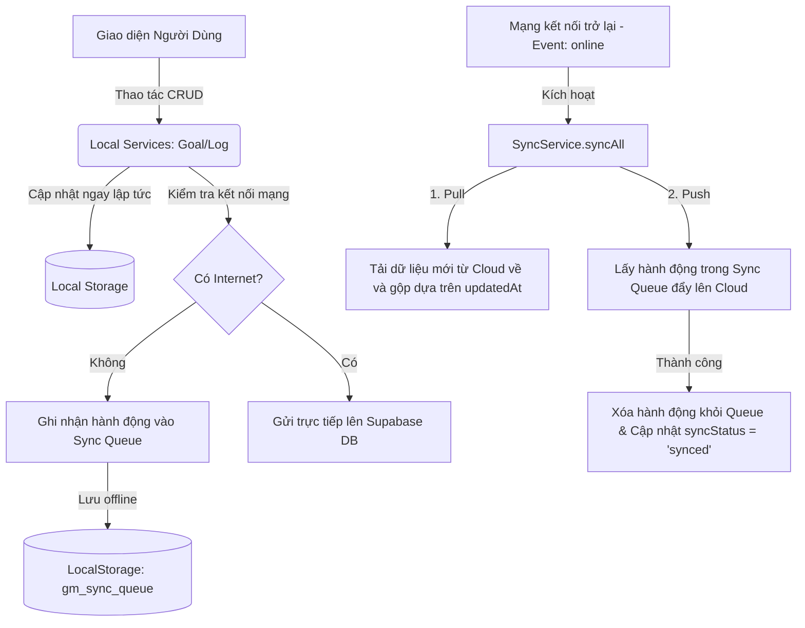

# 🎯 GoalTracker — Hệ thống quản lý mục tiêu cá nhân hiện đại

**GoalTracker** là một ứng dụng Web App (PWA) hiện đại giúp người dùng thiết lập, theo dõi và đạt được các mục tiêu cá nhân một cách có khoa học. Ứng dụng kết hợp sức mạnh của **Angular 21 (Signals)**, **Tailwind CSS v4** (thiết kế theo lưới 8-Point Grid) và hệ thống đám mây **Supabase (Offline-First Sync & Google OAuth)**, mang đến trải nghiệm mượt mà, bảo mật, riêng tư và vô cùng trực quan.

---

## ⚡ Tính năng nổi bật

### 📊 Phân tích tiến độ thông minh & Dự báo (Calculation Engine)

Hệ thống không chỉ đếm số lượng tích lũy đơn thuần mà còn phân tích sâu dữ liệu:

- **Trạng thái thực tế (Progress Status):** Tự động đánh giá hiệu suất của bạn theo thời gian thực:
  - 🟢 **Ahead (Vượt kế hoạch):** Tiến độ thực tế vượt mức kỳ vọng so với kế hoạch hiện tại.
  - 🟡 **On-track (Đúng kế hoạch):** Tiến độ đúng theo quỹ đạo kế hoạch đã đề ra.
  - 🔴 **Behind (Chậm tiến độ):** Chậm tiến độ so với dự tính, cần nỗ lực nhiều hơn.
  - ✅ **Completed (Hoàn thành):** Mục tiêu đã được hoàn thành xuất sắc trước hoặc đúng hạn.
  - ⌛ **Expired (Hết hạn):** Mục tiêu đã quá thời gian kết thúc nhưng chưa đạt đích.
- **Dự báo kết quả (Prediction):** Sử dụng thuật toán dự đoán tổng giá trị đạt được khi kết thúc chu kỳ dựa trên tốc độ tích lũy trung bình hiện tại để cảnh báo người dùng.
- **Tốc độ cần thiết (Required Speed):** Tính toán chính xác lượng cần tích lũy trên mỗi ngày hoặc mỗi tháng còn lại để đảm bảo bạn đạt đích đúng hạn.

### 🔄 Đồng bộ đám mây Hybrid (Offline-First Sync)

Cơ chế đồng bộ hóa dữ liệu thông minh kết hợp giữa hiệu năng ngoại tuyến và độ tin cậy của đám mây:

- **Mô hình Hybrid Storage:** Dữ liệu luôn được lưu trữ an toàn trong `localStorage` để có thể truy xuất tức thì ngay cả khi hoàn toàn mất mạng.
- **Hàng đợi đồng bộ (Sync Queue):** Mọi thao tác thêm/sửa/xóa khi offline được ghi lại vào hàng đợi `gm_sync_queue`. Khi thiết bị kết nối mạng trở lại, `SyncService` sẽ tự động xử lý hàng đợi và đẩy dữ liệu lên **Supabase Cloud DB**.
- **Đồng bộ hóa 2 chiều (Bidirectional Sync):** Tự động gộp dữ liệu từ Cloud và Local dựa trên nhãn thời gian cập nhật gần nhất (`updatedAt`) để tránh xung đột dữ liệu.
- **Chỉ báo trực quan:** Trạng thái đồng bộ của từng mục tiêu và nhật ký tiến độ được thể hiện rõ ràng trên giao diện (nhãn "chờ đồng bộ" hoặc "đã đồng bộ").

### 🔒 Xác thực bảo mật (Modern Authentication)

- **Magic Link:** Đăng nhập không cần mật khẩu nhanh chóng và an toàn qua Email OTP gửi thẳng vào hộp thư.
- **Google OAuth:** Đăng nhập một chạm bằng tài khoản Google, tối ưu hóa sự tiện lợi và bảo mật cấp doanh nghiệp.

### 🎨 Thiết kế Premium & Hệ lưới 8-Point Grid

Giao diện được xây dựng tinh tế với ngôn ngữ thiết kế hiện đại, responsive hoàn hảo:

- **Tailwind CSS v4:** Loại bỏ hoàn toàn SCSS cũ để tận dụng hệ biến CSS và công cụ biên dịch thế hệ mới, tối ưu hóa bundle size và cải thiện tốc độ render.
- **Hệ lưới Spacing 8-Point Grid:** Áp dụng nghiêm ngặt quy tắc chia khoảng cách, lề (`padding`, `margin`) và kích thước là bội số của 8px (hoặc 4px đối với micro-spacing) tạo ra sự thống nhất và cân xứng hoàn mỹ về mặt thị giác.
- **Theme Service (Sáng/Tối):** Chuyển đổi giao diện sáng/tối mượt mà thông qua `ThemeService`, tự động đồng bộ theo tùy chọn hệ thống và lưu trữ trạng thái người dùng.
- **Bảng màu Goal cá nhân hóa:** Chọn màu sắc chủ đạo riêng biệt cho từng mục tiêu với bảng màu preset tuyệt đẹp (Financial Emerald, Health Orange, Learning Purple, v.v.), tự động tính toán pha màu nền mềm mại (`rgba`) và màu chữ tương ứng.

### 🔢 Định dạng số rút gọn thông minh (Compact Numbers)

- Để giữ cho thẻ hiển thị (`GoalCard`) và biểu đồ gọn gàng, các con số lớn được tự động rút gọn một cách thông minh bằng tiếng Việt:
  - Từ `1,000` trở lên rút gọn thành **k** (ví dụ: `12.5 k`)
  - Từ `1,000,000` trở lên rút gọn thành **tr** (ví dụ: `1.2 tr`)
  - Từ `1,000,000,000` trở lên rút gọn thành **tỷ** (ví dụ: `2 tỷ`)
- Tích hợp **hover tooltip** hiển thị chi tiết số liệu chính xác tuyệt đối (ví dụ: `12,543 / 20,000`) để bạn không bỏ lỡ bất kỳ chi tiết nào.

---

## 🛠️ Công nghệ sử dụng

- **Angular 21.2.9:** Sử dụng **Signals** cho quản lý trạng thái phản xạ (Reactive State Management) giúp đạt hiệu năng tối đa mà không cần chạy cơ chế phát hiện thay đổi nặng nề của Zone.js.
- **Tailwind CSS v4.3.0 & PostCSS:** Khung thiết kế tiện ích thế hệ mới nhất cho trải nghiệm phát triển hiện đại và giao diện tinh tế.
- **Supabase JS SDK v2.105.4:** Quản lý cơ sở dữ liệu thời gian thực và xác thực người dùng.
- **Chart.js v4.4.3:** Trực quan hóa tiến độ bằng biểu đồ Doughnut động, mượt mà.
- **Angular Service Worker:** Tự động hóa bộ nhớ đệm (caching), cung cấp khả năng chạy ngoại tuyến hoàn toàn và thông báo cập nhật ngầm.
- **TypeScript 5.9.3:** Đảm bảo tính an toàn kiểu dữ liệu và chất lượng mã nguồn ở mức cao nhất.

---

## 🏗️ Kiến trúc thư mục dự án

```text
src/app/
├── core/
│   └── services/               # Logic nghiệp vụ, APIs & Quản lý trạng thái
│       ├── auth.service.ts      # Xác thực người dùng (Google OAuth / Magic Link)
│       ├── supabase.service.ts  # Khởi tạo và quản lý kết nối client Supabase
│       ├── sync.service.ts      # Đồng bộ hóa dữ liệu 2 chiều & Xử lý trạng thái online
│       ├── sync-queue.service.ts# Hàng đợi hành động offline (CREATE, UPDATE, DELETE)
│       ├── calculation.service.ts # Thuật toán tính tiến độ, dự báo, chuỗi streak & mốc
│       ├── goal.service.ts      # Nghiệp vụ CRUD Mục tiêu (Goals)
│       ├── log.service.ts       # Nghiệp vụ CRUD Nhật ký tiến độ (Logs)
│       ├── theme.service.ts     # Trình quản lý chế độ màu Sáng/Tối (Light/Dark Mode)
│       └── pwa-update.service.ts# Trình phát hiện và tự động áp dụng bản cập nhật PWA mới
├── shared/
│   └── models/                 # Định nghĩa kiểu dữ liệu đồng nhất
│       ├── goal.model.ts        # Interface Goal, GoalStats, MilestoneStatus
│       └── log.model.ts         # Interface Log ghi nhận tiến độ
├── components/                 # Các thành phần UI tái sử dụng cao
│   ├── goal-card/               # Thẻ hiển thị tóm tắt mục tiêu (Tailwind CSS, Compact numbers, Tooltips)
│   ├── goal-form/               # Biểu mẫu thêm/sửa mục tiêu với bảng chọn màu preset
│   ├── log-form/                # Biểu mẫu ghi chép nhật ký tiến độ
│   └── progress-chart/          # Biểu đồ Doughnut trực quan tiến độ goal
└── pages/                      # Các trang màn hình chính
    ├── login/                   # Màn hình đăng nhập (Google OAuth / Magic Link)
    ├── dashboard/               # Trang tổng quan danh sách mục tiêu
    └── goal-detail/             # Chi tiết mục tiêu, biểu đồ Chart.js và lịch sử ghi nhận
```

---

## 💾 Cơ chế lưu trữ & Đồng bộ dữ liệu chi tiết

GoalTracker áp dụng chiến lược **Hybrid Storage** hoạt động theo mô hình sau:



- **Trạng thái đồng bộ (`syncStatus`):**
  - `pending`: Thay đổi đang nằm trong Queue local, chưa được lưu lên đám mây. Trên giao diện sẽ hiển thị biểu tượng đồng bộ màu cam/vàng.
  - `synced`: Dữ liệu đã an toàn trên Cloud.

---

## 🚀 Hướng dẫn khởi động nhanh

### 1. Yêu cầu hệ thống

- **Node.js:** Phiên bản 18.x trở lên
- **npm:** Phiên bản 9.x trở lên

### 2. Cài đặt môi trường phát triển

Cài đặt các thư viện phụ thuộc:

```bash
npm install
```

### 3. Cấu hình Supabase

Các tham số cấu hình kết nối đến Supabase được khai báo trong thư mục `src/environments/`:

- `src/environments/environment.ts` (môi trường phát triển)
- `src/environments/environment.production.ts` (môi trường production)

Cấu trúc file cấu hình:

```typescript
export const environment = {
  production: false,
  supabaseUrl: "https://<your-project-id>.supabase.co",
  supabaseKey: "<your-anon-key>",
};
```

### 4. Khởi chạy ứng dụng

Chạy máy chủ phát triển cục bộ:

```bash
npm start
```

Mở trình duyệt của bạn tại địa chỉ: [http://localhost:4200](http://localhost:4200)

---

## 📱 Khả năng chạy Offline & Cài đặt PWA

Ứng dụng được cấu hình đầy đủ như một **Progressive Web App**:

### Trên thiết bị di động (iOS & Android)

1. Mở trang web ứng dụng bằng **Safari** (iOS) hoặc **Chrome** (Android).
2. Chọn biểu tượng **Chia sẻ** (Safari) hoặc dấu ba chấm ở góc phải (Chrome).
3. Chọn **Thêm vào màn hình chính (Add to Home Screen)**.
4. Ứng dụng sẽ hoạt động độc lập dưới dạng giao diện app native, loại bỏ hoàn toàn thanh địa chỉ trình duyệt.

### Trên máy tính (Desktop Chrome/Edge/Safari)

1. Nhấp vào biểu tượng **Cài đặt (Install)** ở phía bên phải thanh địa chỉ (Omnibox).
2. Nhấn chọn Cài đặt ứng dụng để đưa icon ra màn hình Desktop.

---

## 📦 Đóng gói & Triển khai Production

Tạo bản dựng production tối ưu hóa dung lượng:

```bash
npm run build:prod
```

Bản dựng hoàn chỉnh sẽ được tạo ra tại thư mục: `dist/goal-manager/browser/` sẵn sàng để tải lên các nền tảng hosting tĩnh (như Vercel, Netlify, Github Pages hoặc cPanel).
