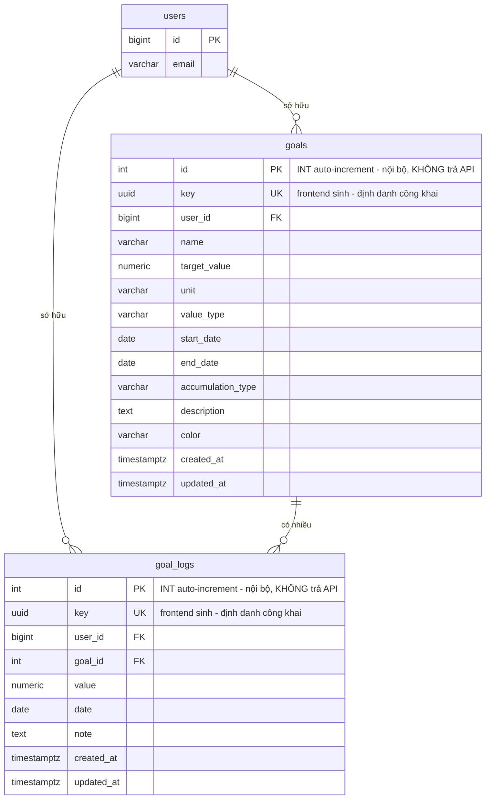

# Đặc tả Backend — Goal Tracker (`api.thanhdc.dev`)

> Tài liệu dành cho **đội Backend** để hiện thực phần lưu trữ dữ liệu (goals/logs) cho webapp Goal Tracker.
> Phần **auth (OAuth v2)** đã có hệ thống sẵn và không thuộc phạm vi tài liệu này — xem `docs/auth-login-v2-integration.md`.
> Ngày tạo: 2026-09-12.

---

## 1. Tổng quan

Webapp Goal Tracker là SPA/PWA **offline-first**, hiện lưu dữ liệu tại `localStorage` và đồng bộ lên server.
Frontend **không gửi `user_id`** trong payload — server **suy user từ Bearer token**.

Backend cần cung cấp:

- **2 bảng CSDL**: `goals`, `goal_logs` (tham chiếu bảng `users` có sẵn của hệ thống auth).
- **8 endpoint REST** CRUD (4 cho `goals`, 4 cho `goal-logs`).

Mọi phép tính thống kê (progress, streak, milestone, dự đoán…) được thực hiện **ở client** (`CalculationService`).
Backend **chỉ lưu trữ và trả dữ liệu thô** — không cần tính toán nghiệp vụ.

---

## 2. Quy ước chung

| Hạng mục | Quy ước |
|---|---|
| Base URL | `https://api.thanhdc.dev` |
| Xác thực | `Authorization: Bearer <accessToken>` bắt buộc cho **mọi** endpoint bên dưới |
| Content-Type | `application/json` |
| Đặt tên field | **camelCase** trong JSON (map từ snake_case trong DB) |
| Timestamp (`createdAt`, `updatedAt`) | Chuỗi **ISO 8601 UTC**, ví dụ `2026-09-12T08:30:00.000Z` |
| Ngày (`startDate`, `endDate`, `date`) | Chuỗi **`YYYY-MM-DD`** (date-only, không timezone) |
| Phạm vi dữ liệu | Mọi truy vấn **tự động lọc theo user hiện tại**; user không truy cập được dữ liệu của user khác |
| Xoá | **Hard delete** (xoá vật lý khỏi DB) |
| Danh sách | Trả **toàn bộ** dữ liệu của user (không phân trang ở giai đoạn này) |

### 2.1. Chiến lược ID (quan trọng)

Mỗi bản ghi có **2 định danh**:

- `key` — **UUID do FRONTEND sinh** (client gửi trong body khi `POST`) — là **định danh công khai**, dùng trong mọi API và mọi tham chiếu (path param, `goalKey`).
- `id` — **`INT` auto-increment (số nguyên, tự tăng) do BACKEND sinh** — **chỉ dùng nội bộ** làm khoá chính/FK, **không trả ra API**.

Vì `key` do client sinh nên:

- Client biết định danh **ngay lập tức** khi tạo offline → **không cần reconcile ID**.
- `POST` là **idempotent theo `key`**: nếu `key` đã tồn tại (cùng user) → **không tạo mới**, trả bản ghi cũ.

FK giữa `goal_logs` và `goals` dùng `id` (số) nội bộ. Trong API, `log.goalKey` là **`key` (UUID) của goal**; server tự resolve sang `goals.id`.

> ➡️ **Frontend dùng `key` làm định danh:** `Goal.key`, `Log.key`, `Log.goalKey` (string UUID). Backend `id` số **không** trả về.

### 2.2. Format lỗi (thống nhất với hệ thống hiện có)

```json
{
  "timestamp": "2026-09-12T08:30:00.000Z",
  "method": "POST",
  "path": "/goals",
  "statusCode": 400,
  "code": "VALIDATION_FAIL",
  "error": null
}
```

| HTTP | `code` | Ngữ cảnh |
|---|---|---|
| `400` | `VALIDATION_FAIL` | Thiếu/sai field trong body hoặc query |
| `401` | `UNAUTHORIZED` | Thiếu/sai/hết hạn token |
| `404` | *NotFoundException* | Không tìm thấy bản ghi (hoặc không thuộc user) |
| `429` | `TOO_MANY_REQUESTS` | Vượt rate limit |

### 2.3. CORS

Cho phép origin của webapp (dev + production) gọi API, kèm header `Authorization` và method `GET, POST, PUT, DELETE, OPTIONS`.

---

## 3. Sơ đồ quan hệ



---

## 4. Thiết kế CSDL

> Ví dụ DDL theo **PostgreSQL**. Điều chỉnh cú pháp nếu backend dùng hệ CSDL khác.

### 4.1. Bảng `goals`

| Cột | Kiểu | Ràng buộc | Mô tả |
|---|---|---|---|
| `id` | `INT` | PK, auto-increment (**nội bộ**) | Khoá chính do backend sinh — **không trả ra API** |
| `key` | `UUID` | NOT NULL, UNIQUE | Định danh công khai do **frontend** sinh → JSON `key` |
| `user_id` | `BIGINT` | NOT NULL, FK → `users(id)` | Chủ sở hữu (suy từ token) |
| `name` | `VARCHAR(255)` | NOT NULL | Tên mục tiêu |
| `target_value` | `NUMERIC(18,4)` | NOT NULL, `> 0` | Giá trị đích |
| `unit` | `VARCHAR(50)` | NOT NULL | Đơn vị ("km", "cuốn sách"…) |
| `value_type` | `VARCHAR(10)` | NOT NULL, IN (`integer`,`decimal`) | Kiểu giá trị nhập |
| `start_date` | `DATE` | NOT NULL | Ngày bắt đầu |
| `end_date` | `DATE` | NOT NULL, `> start_date` | Ngày kết thúc |
| `accumulation_type` | `VARCHAR(10)` | NOT NULL, IN (`daily`,`monthly`) | Chu kỳ tích luỹ |
| `description` | `TEXT` | NULL | Mô tả (tuỳ chọn) |
| `color` | `VARCHAR(9)` | NULL | Màu hex, dạng `#rrggbb` |
| `created_at` | `TIMESTAMPTZ` | NOT NULL, default `now()` | Thời điểm tạo |
| `updated_at` | `TIMESTAMPTZ` | NOT NULL, default `now()` | Cập nhật mỗi lần ghi (client merge theo field này) |

### 4.2. Bảng `goal_logs`

> Tên bảng là **`goal_logs`** (không phải `logs`) để **phân biệt với các loại log khác ở backend** (system log, audit log, request log…).
> API resource tương ứng dùng prefix **`/goal-logs`** (xem §6).

| Cột | Kiểu | Ràng buộc | Mô tả |
|---|---|---|---|
| `id` | `INT` | PK, auto-increment (**nội bộ**) | Khoá chính do backend sinh — **không trả ra API** |
| `key` | `UUID` | NOT NULL, UNIQUE | Định danh công khai do **frontend** sinh → JSON `key` |
| `user_id` | `BIGINT` | NOT NULL, FK → `users(id)` | Chủ sở hữu (suy từ token) |
| `goal_id` | `INT` | NOT NULL, FK → `goals(id)` **ON DELETE CASCADE** | Goal chứa log này (resolve từ `goalKey`) |
| `value` | `NUMERIC(18,4)` | NOT NULL, `> 0` | Giá trị ghi nhận |
| `date` | `DATE` | NOT NULL | Ngày ghi nhận |
| `note` | `TEXT` | NULL | Ghi chú (tuỳ chọn) |
| `created_at` | `TIMESTAMPTZ` | NOT NULL, default `now()` | Thời điểm tạo |
| `updated_at` | `TIMESTAMPTZ` | NOT NULL, default `now()` | Cập nhật mỗi lần ghi |

### 4.3. Indexes

| Bảng | Index | Mục đích |
|---|---|---|
| `goals` | `(user_id)` | Lọc theo user |
| `goals` | `(user_id, updated_at)` | Hỗ trợ delta sync về sau |
| `goals` | UNIQUE `(key)` | Tra cứu theo định danh công khai + idempotent khi create |
| `goal_logs` | `(user_id)` | Lọc theo user |
| `goal_logs` | `(goal_id)` | Lấy log theo goal |
| `goal_logs` | `(goal_id, date)` | Sắp xếp/lọc theo ngày |
| `goal_logs` | UNIQUE `(key)` | Tra cứu theo định danh công khai + idempotent khi create |

### 4.4. DDL tham khảo

```sql
-- Bảng users đã tồn tại từ hệ thống auth; giả định PK là BIGINT.
-- Nếu PK users là kiểu khác, đổi kiểu user_id tương ứng.

CREATE TABLE goals (
  id                SERIAL PRIMARY KEY,    -- INT auto-increment, nội bộ, KHÔNG trả API
  key               UUID NOT NULL,          -- frontend sinh, định danh công khai
  user_id           BIGINT NOT NULL REFERENCES users(id) ON DELETE CASCADE,
  name              VARCHAR(255) NOT NULL,
  target_value      NUMERIC(18,4) NOT NULL CHECK (target_value > 0),
  unit              VARCHAR(50) NOT NULL,
  value_type        VARCHAR(10) NOT NULL CHECK (value_type IN ('integer','decimal')),
  start_date        DATE NOT NULL,
  end_date          DATE NOT NULL,
  accumulation_type VARCHAR(10) NOT NULL CHECK (accumulation_type IN ('daily','monthly')),
  description       TEXT,
  color             VARCHAR(9) CHECK (color IS NULL OR color ~ '^#[0-9a-fA-F]{6}([0-9a-fA-F]{2})?$'),
  created_at        TIMESTAMPTZ NOT NULL DEFAULT now(),
  updated_at        TIMESTAMPTZ NOT NULL DEFAULT now(),
  CONSTRAINT goals_key_uniq UNIQUE (key),
  CONSTRAINT goals_dates_chk CHECK (end_date > start_date)
);

CREATE INDEX idx_goals_user         ON goals (user_id);
CREATE INDEX idx_goals_user_updated ON goals (user_id, updated_at);

CREATE TABLE goal_logs (
  id         SERIAL PRIMARY KEY,    -- INT auto-increment, nội bộ, KHÔNG trả API
  key        UUID NOT NULL,          -- frontend sinh, định danh công khai
  user_id    BIGINT NOT NULL REFERENCES users(id) ON DELETE CASCADE,
  goal_id    INT NOT NULL REFERENCES goals(id) ON DELETE CASCADE,
  value      NUMERIC(18,4) NOT NULL CHECK (value > 0),
  date       DATE NOT NULL,
  note       TEXT,
  created_at TIMESTAMPTZ NOT NULL DEFAULT now(),
  updated_at TIMESTAMPTZ NOT NULL DEFAULT now(),
  CONSTRAINT goal_logs_key_uniq UNIQUE (key)
);

CREATE INDEX idx_goal_logs_user      ON goal_logs (user_id);
CREATE INDEX idx_goal_logs_goal      ON goal_logs (goal_id);
CREATE INDEX idx_goal_logs_goal_date ON goal_logs (goal_id, date);
```

> **Lưu ý kiểu `id`:** `SERIAL` = **`INT` + auto-increment** (PostgreSQL). Nếu backend dùng MySQL/MariaDB → `INT AUTO_INCREMENT`; SQL Server → `INT IDENTITY(1,1)`.
>
> Khuyến nghị: dùng **trigger** hoặc tầng service để luôn cập nhật `updated_at = now()` mỗi khi `UPDATE`.
> **Lưu ý:** khi `POST /goals` trả về, client cần `updatedAt` chính xác để thực hiện merge (xem §7).

---

## 5. API — Goals

### 5.1. Danh sách goals

```
GET /goals
```

- **Auth:** Bearer bắt buộc
- **Request body:** không
- **Response `200`:** mảng `GoalResponse` (toàn bộ goal của user, sắp xếp tuỳ ý — client tự sort)

**Ví dụ response:**

```json
[
  {
    "key": "3f2504e0-4f89-41d3-9a0c-0305e82c3301",
    "name": "Đọc sách",
    "targetValue": 12,
    "unit": "cuốn",
    "valueType": "integer",
    "startDate": "2026-01-01",
    "endDate": "2026-12-31",
    "accumulationType": "monthly",
    "description": "Đọc 1 cuốn mỗi tháng",
    "color": "#7c6ff7",
    "createdAt": "2026-01-01T03:00:00.000Z",
    "updatedAt": "2026-09-01T10:15:00.000Z"
  }
]
```

### 5.2. Tạo goal

```
POST /goals
```

- **Auth:** Bearer bắt buộc

**Request body (`CreateGoalRequest`):**

| Field | Kiểu | Bắt buộc | Ràng buộc |
|---|---|---|---|
| `key` | string (uuid) | ✅ | UUID do **frontend** sinh; định danh công khai + idempotency |
| `name` | string | ✅ | 1–255 ký tự |
| `targetValue` | number | ✅ | `> 0` |
| `unit` | string | ✅ | 1–50 ký tự |
| `valueType` | `"integer"` \| `"decimal"` | ✅ | — |
| `startDate` | string `YYYY-MM-DD` | ✅ | — |
| `endDate` | string `YYYY-MM-DD` | ✅ | `> startDate` |
| `accumulationType` | `"daily"` \| `"monthly"` | ✅ | — |
| `description` | string | ❌ | — |
| `color` | string | ❌ | hex `#rrggbb` |

> **`key` do client sinh** và là **định danh công khai**; backend **không** trả `id` số.
> `POST` là **idempotent theo `key`**: nếu `key` đã tồn tại (cùng user) → **không tạo mới**, trả `200` kèm bản ghi cũ.

**Response `201`:** `GoalResponse` (xem §5.1).

**Ví dụ request:**

```json
{
  "key": "b1e3c2a4-1111-4aaa-8bbb-000000000001",
  "name": "Chạy bộ",
  "targetValue": 500,
  "unit": "km",
  "valueType": "decimal",
  "startDate": "2026-09-01",
  "endDate": "2026-12-31",
  "accumulationType": "daily",
  "description": "Chạy 500km trong 4 tháng",
  "color": "#4ade80"
}
```

### 5.3. Lấy chi tiết goal *(tuỳ chọn)*

```
GET /goals/:key
```

- `:key` = UUID (`response.key`)
- **Response `200`:** `GoalResponse`; **`404`** nếu không tồn tại / không thuộc user.

### 5.4. Cập nhật goal

```
PUT /goals/:key
```

- `:key` = UUID
- **Request body:** giống `CreateGoalRequest` (đã có `key`), cho phép gửi **đầy đủ** các field cần cập nhật (client hiện gửi full object). Các field bắt buộc vẫn phải hợp lệ.
- **Response `200`:** `GoalResponse` (với `updatedAt` mới); **`404`** nếu không tồn tại.

### 5.5. Xoá goal

```
DELETE /goals/:key
```

- `:key` = UUID
- Xoá vật lý; **logs liên quan tự động bị xoá theo** (FK `ON DELETE CASCADE`).
- **Response `204 No Content`**; **`404`** nếu không tồn tại.

---

## 6. API — Goal Logs (`/goal-logs`)

> Path API dùng prefix **`/goal-logs`**, đồng bộ với tên bảng `goal_logs`.

### 6.1. Danh sách goal logs

```
GET /goal-logs
```

- **Response `200`:** mảng `LogResponse` (toàn bộ log của user)

**Ví dụ response:**

```json
[
  {
    "key": "9c8b7a65-4321-4fed-8cba-1234567890ab",
    "goalKey": "3f2504e0-4f89-41d3-9a0c-0305e82c3301",
    "value": 5,
    "date": "2026-09-10",
    "note": "Chạy buổi sáng",
    "createdAt": "2026-09-10T01:20:00.000Z",
    "updatedAt": "2026-09-10T01:20:00.000Z"
  }
]
```

### 6.2. Tạo goal log

```
POST /goal-logs
```

**Request body (`CreateLogRequest`):**

| Field | Kiểu | Bắt buộc | Ràng buộc |
|---|---|---|---|
| `key` | string (uuid) | ✅ | UUID do frontend sinh |
| `goalKey` | string (uuid) | ✅ | `key` của goal **thuộc user hiện tại** |
| `value` | number | ✅ | `> 0` |
| `date` | string `YYYY-MM-DD` | ✅ | — |
| `note` | string | ❌ | — |

- Backend sinh `id` nội bộ; response chỉ trả `key`.
- `key` trùng (cùng user) → trả `200` + bản ghi cũ (idempotent).
- `goalKey` không thuộc user → `404`.

**Response `201`:** `LogResponse`; **`400`** nếu validation fail.

### 6.3. Cập nhật goal log

```
PUT /goal-logs/:key
```

- `:key` = UUID
- **Request body:** `value`, `date`, `note?` (không cho đổi `goalKey` — nếu muốn đổi goal thì xoá + tạo mới).
- **Response `200`:** `LogResponse`; **`404`** nếu không tồn tại.

### 6.4. Xoá goal log

```
DELETE /goal-logs/:key
```

- `:key` = UUID
- **Response `204 No Content`**; **`404`** nếu không tồn tại.

### 6.5. *(Tuỳ chọn)* Goal logs theo goal

```
GET /goals/:key/goal-logs
```

- Trả `LogResponse[]` của một goal. Hiện frontend **không dùng** endpoint này (đã có full list) — chỉ thêm nếu backend muốn hỗ trợ về sau.

---

## 7. Bảng map field đầy đủ (DB ↔ API ↔ Frontend)

### Goal

| DB column | API JSON | Kiểu JSON | Frontend model (`Goal`) |
|---|---|---|---|
| `key` | `key` | string (uuid) | `key` |
| `name` | `name` | string | `name` |
| `target_value` | `targetValue` | number | `targetValue` |
| `unit` | `unit` | string | `unit` |
| `value_type` | `valueType` | string | `valueType` |
| `start_date` | `startDate` | string `YYYY-MM-DD` | `startDate` |
| `end_date` | `endDate` | string `YYYY-MM-DD` | `endDate` |
| `accumulation_type` | `accumulationType` | string | `accumulationType` |
| `description` | `description` | string \| null | `description?` |
| `color` | `color` | string \| null | `color?` |
| `created_at` | `createdAt` | string ISO | `createdAt` |
| `updated_at` | `updatedAt` | string ISO | `updatedAt` |
| `id` | *(không trả)* | — | *(nội bộ backend)* |
| `user_id` | *(không trả)* | — | *(suy từ token)* |

### Log

| DB column | API JSON | Kiểu JSON | Frontend model (`Log`) |
|---|---|---|---|
| `key` | `key` | string (uuid) | `key` |
| `goal_id` | `goalKey` | string (uuid) | `goalKey` |
| `value` | `value` | number | `value` |
| `date` | `date` | string `YYYY-MM-DD` | `date` |
| `note` | `note` | string \| null | `note?` |
| `created_at` | `createdAt` | string ISO | `createdAt` |
| `updated_at` | `updatedAt` | string ISO | `updatedAt` |
| `id` | *(không trả)* | — | *(nội bộ backend)* |
| `user_id` | *(không trả)* | — | *(suy từ token)* |

---

## 8. Validation rules (server bắt buộc kiểm tra)

| Entity | Field | Rule |
|---|---|---|
| Goal | `key` | UUID hợp lệ (do client sinh), bắt buộc khi create |
| Goal | `name` | không rỗng, ≤ 255 |
| Goal | `targetValue` | `> 0`, tối đa 4 chữ số thập phân |
| Goal | `unit` | không rỗng, ≤ 50 |
| Goal | `valueType` | ∈ {`integer`, `decimal`} |
| Goal | `startDate` | đúng định dạng `YYYY-MM-DD` |
| Goal | `endDate` | đúng định dạng, `> startDate` |
| Goal | `accumulationType` | ∈ {`daily`, `monthly`} |
| Goal | `color` | nếu có: khớp `^#[0-9a-fA-F]{6}$` |
| Log | `key` | UUID hợp lệ (do client sinh), bắt buộc khi create |
| Log | `goalKey` | UUID hợp lệ, là goal thuộc user hiện tại |
| Log | `value` | `> 0` |
| Log | `date` | đúng định dạng `YYYY-MM-DD` |

---

## 9. Checklist bàn giao Backend

- [ ] Tạo bảng `goals`, `goal_logs` + indexes + FK `ON DELETE CASCADE`.
- [ ] Backend tự sinh `id` (`INT` auto-increment) nội bộ; **nhận `key` (UUID) do client gửi** và **trả `key`** trong response (không trả `id`).
- [ ] 4 endpoint `/goals` (GET list, POST, PUT, DELETE) — path param dùng `key`.
- [ ] 4 endpoint `/goal-logs` (GET list, POST, PUT, DELETE) — path param dùng `key`.
- [ ] Suy `user_id` từ Bearer token cho mọi request; lọc dữ liệu theo user.
- [ ] Trả lỗi đúng format §2.2.
- [ ] Bật CORS cho origin webapp.
- [ ] Cập nhật `updated_at` mỗi lần ghi và trả về trong response.
- [ ] Hỗ trợ idempotency theo `key` khi `POST` (key đã tồn tại → trả bản ghi cũ, không tạo trùng).
- [ ] Kiểm thử: tạo goal → tạo log → sửa → xoá goal (đảm bảo logs cascade).
