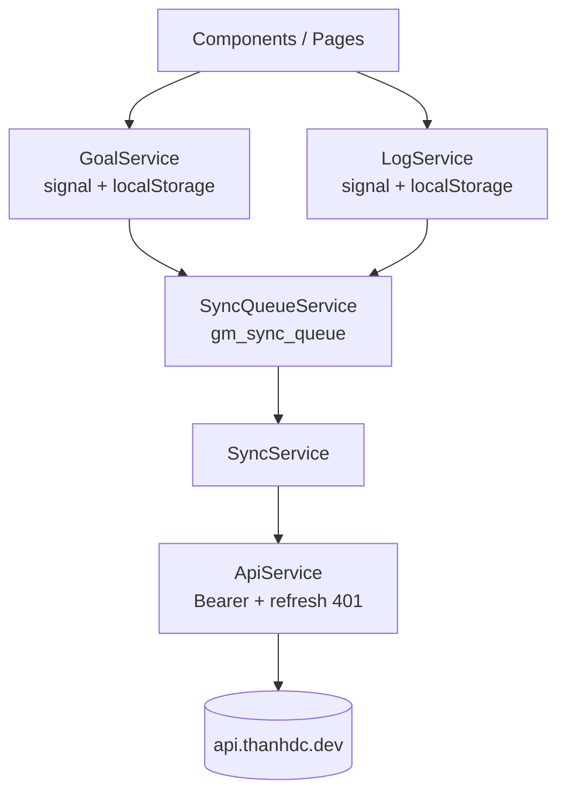
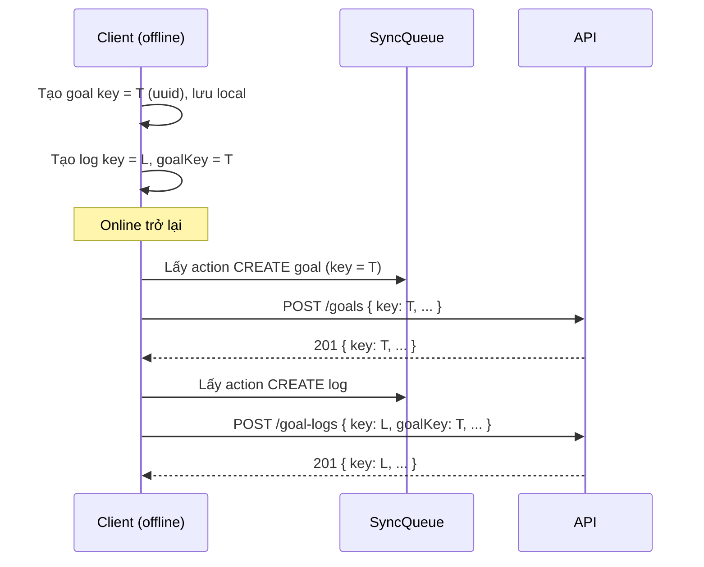
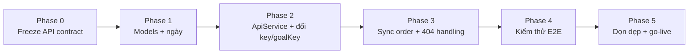

# Kế hoạch di chuyển Backend → API nội bộ `api.thanhdc.dev`

> Kế hoạch di chuyển tầng lưu trữ dữ liệu (goals/logs) từ **Supabase** sang **API nội bộ `https://api.thanhdc.dev`**.
> Ngày tạo: 2026-09-12. Tài liệu đặc tả backend đi kèm: [`backend-api-spec.md`](./backend-api-spec.md).

---

## 1. Mục tiêu & phạm vi

### Mục tiêu

- Loại bỏ hoàn toàn phụ thuộc Supabase (auth + data) trong webapp.
- Đồng bộ dữ liệu goals/logs qua REST API nội bộ, server suy user từ Bearer token.
- Giữ nguyên trải nghiệm **offline-first**: localStorage + sync queue + merge theo `updatedAt`.

### Trong phạm vi

- Tầng đồng bộ dữ liệu goals/logs (`ApiService`, `SyncService`, `GoalService`, `LogService`).
- Đổi định danh công khai sang `key` (UUID do client sinh) — backend tự sinh `id` (`INT` auto-increment) nội bộ.
- Đồng bộ tên resource log: bảng **`goal_logs`**, API **`/goal-logs`** (thay cho `logs` / `/logs`).
- Chuẩn hoá định dạng ngày gửi/nhận API (`YYYY-MM-DD`).

### Ngoài phạm vi

- **Auth (OAuth v2)** — đã migrate xong ở commit `9457139`, không thay đổi.
- Di chuyển dữ liệu người dùng cũ từ Supabase (xem §4, quyết định #5 — bắt đầu mới).
- Tính toán thống kê (`CalculationService`) — giữ nguyên ở client.

---

## 2. Hiện trạng

### 2.1. Thực trạng code

| Hạng mục | Trạng thái |
|---|---|
| Auth | ✅ Đã dùng API nội bộ OAuth v2 (`login-url`, `callback`, `me`, `refresh`, `logout`) |
| Data sync | ⚠️ Đang dùng `ApiService` với **hợp đồng REST giả định** (`GET/POST/PUT/DELETE /goals`, `/logs`) — chưa có backend thật. **Đích:** dùng `key`/`goalKey` và prefix `/goal-logs` |
| Supabase | ✅ Đã gỡ khỏi code (`supabase.service.ts` đã xoá); chỉ còn trong ghi chú lịch sử |

> Nghĩa là: phần **auth đã xong**, phần **data sync cần chốt hợp đồng với backend** theo `backend-api-spec.md` và điều chỉnh code cho khớp.

### 2.2. Kiến trúc hiện tại



### 2.3. Dữ liệu local (localStorage)

| Key | Nội dung |
|---|---|
| `gm_goals` | Mảng `Goal` |
| `gm_logs` | Mảng `Log` |
| `gm_sync_queue` | Hàng đợi `SyncAction` (CREATE/UPDATE/DELETE) |
| `gm_access_token`, `gm_refresh_token` | Token OAuth |
| `gm_theme` | Theme sáng/tối |

### 2.4. Model hiện tại

```ts
interface Goal {
  id: string;              // hiện do client sinh (crypto.randomUUID)
  name: string;
  targetValue: number;
  unit: string;
  valueType: 'integer' | 'decimal';
  startDate: string;       // hiện lưu ISO đầy đủ, không phải YYYY-MM-DD
  endDate: string;
  accumulationType: 'daily' | 'monthly';
  description?: string;
  color?: string;
  createdAt: string;
  updatedAt: string;
  userId?: number;
  syncStatus?: 'synced' | 'pending' | 'error';
}

interface Log {
  id: string;              // hiện do client sinh
  goalId: string;
  value: number;
  date: string;            // hiện lưu ISO đầy đủ
  note?: string;
  createdAt: string;
  updatedAt: string;
  userId?: number;
  syncStatus?: 'synced' | 'pending' | 'error';
}
```

### 2.5. Schema Supabase cũ (chỉ để tham chiếu)

| Bảng Supabase | Cột chính |
|---|---|
| `goals` | `id (uuid), name, target_value, unit, value_type, start_date, end_date, accumulation_type, description, color, user_id (uuid), created_at, updated_at` |
| `logs` | `id (uuid), goal_id (uuid), value, date, note, user_id (uuid), created_at, updated_at` |

> Các tên bảng/endpoint trên là của **Supabase (lịch sử)**. Thiết kế mới dùng bảng `goal_logs` và API `/goal-logs`.

### 2.6. Model đích sau migrate

```ts
interface Goal {
  key: string;             // UUID do client sinh (crypto.randomUUID)
  name: string;
  targetValue: number;
  unit: string;
  valueType: 'integer' | 'decimal';
  startDate: string;       // YYYY-MM-DD
  endDate: string;         // YYYY-MM-DD
  accumulationType: 'daily' | 'monthly';
  description?: string;
  color?: string;
  createdAt: string;       // ISO
  updatedAt: string;       // ISO
  syncStatus?: 'synced' | 'pending' | 'error';
}

interface Log {
  key: string;             // UUID do client sinh
  goalKey: string;         // key của Goal
  value: number;
  date: string;            // YYYY-MM-DD
  note?: string;
  createdAt: string;       // ISO
  updatedAt: string;       // ISO
  syncStatus?: 'synced' | 'pending' | 'error';
}
```

> Backend `id` (`INT` auto-increment) **không** trả về client; `userId` không cần lưu ở client (suy từ Bearer token).

---

## 3. So sánh Before / After

| Khía cạnh | Supabase (Before) | API nội bộ (After) |
|---|---|---|
| Xác thực | Supabase Auth (Google OAuth + Magic Link) | OAuth v2 nội bộ (đã xong) |
| `userId` | UUID (string) | number (từ `AuthUser.id`) |
| Truy vấn dữ liệu | `supabase.from('goals').select()` client-side | `GET /goals`, `GET /goal-logs` |
| Ghi dữ liệu | `upsert()` trực tiếp | `POST` / `PUT` / `DELETE` |
| Định danh bản ghi | UUID do client hoặc Supabase sinh | **`key` = UUID do client sinh** (giữ cách sinh hiện tại); server lưu `id` số nội bộ và chỉ trả `key` |
| Đặt tên field | snake_case (DB) ↔ camelCase (app, map thủ công) | camelCase thẳng từ API |
| Bảo mật | RLS policy phía Supabase | Server lọc theo Bearer token |
| Xoá | hard delete | hard delete |
| Offline | queue + merge `updatedAt` | giữ nguyên queue + merge `updatedAt` |

---

## 4. Quyết định đã chốt

| # | Quyết định | Ghi chú |
|---|---|---|
| 1 | Tài liệu **bỏ qua auth**, chỉ tập trung `goals`/`logs` | Auth đã xong, có doc riêng |
| 2 | **`key` (UUID) do FRONTEND sinh** — định danh công khai dùng trong mọi API. Backend tự tạo **`id` (`INT`, auto-increment)** làm PK nội bộ và **không trả `id`**. `POST` idempotent theo `key` | Không cần reconcile ID; chỉ cần đổi tên field `id`→`key`, `goalId`→`goalKey` |
| 3 | Sync theo **REST CRUD full-list** (`GET /goals`, `GET /goal-logs`) | Khớp code hiện tại, ít thay đổi nhất |
| 4 | **Hard delete** | `goal_logs` xoá cascade khi xoá goal |
| 5 | **Không migrate** dữ liệu Supabase cũ | Chấp nhận mất dữ liệu local cũ |
| 6 | Tài liệu **Markdown tiếng Việt** trong `docs/` | — |
| 7 | Đổi tên bảng backend `logs` → **`goal_logs`** và **đổi API prefix `/logs` → `/goal-logs`** | Đồng bộ tên bảng và API; tránh nhầm với system/audit log |

> ✅ Quyết định #2 giữ nguyên lợi thế offline-first: client biết `key` ngay khi tạo nên **không cần reconcile ID**.

---

## 5. Thay đổi cần thực hiện phía Frontend

### 5.1. Tổng quan file bị ảnh hưởng

| File | Thay đổi dự kiến |
|---|---|
| `src/app/shared/models/goal.model.ts` | Đổi `id` → **`key: string`** (vẫn do client sinh); `startDate`/`endDate` chuẩn hoá `YYYY-MM-DD` |
| `src/app/shared/models/log.model.ts` | Đổi `id` → **`key: string`**, `goalId` → **`goalKey: string`**; `date` chuẩn hoá `YYYY-MM-DD` |
| `src/app/core/services/api.service.ts` | DTO dùng `key`/`goalKey`; đổi path `/logs` → `/goal-logs`, path param `key` |
| `src/app/core/services/goal.service.ts` | Đổi `id` → `key`, `getById` → `getByKey` (giữ `crypto.randomUUID()`) |
| `src/app/core/services/log.service.ts` | Đổi `id`→`key`, `goalId`→`goalKey`; nhóm log theo `goalKey` |
| `src/app/core/services/sync.service.ts` | Merge theo `key`; đảm bảo thứ tự queue (goal create trước log create); bỏ merge `userId` |
| `src/app/pages/goal-detail/*`, `src/app/app.routes.ts` | Route `/goal/:id` → `/goal/:key`; `getById` → `getByKey` |
| `src/app/components/goal-form/goal-form.component.ts` | Gửi ngày dạng `YYYY-MM-DD` (bỏ `toISOString()` full) |
| `src/app/components/log-form/log-form.component.ts` | Gửi ngày dạng `YYYY-MM-DD` |
| `src/environments/environment*.ts` | Đã đúng (`apiBaseUrl`) — chỉ xác nhận |

### 5.2. Định danh `key` & luồng offline (đã đơn giản hoá)

**Điểm cốt lõi:** `key` (UUID) do **client** sinh và **không đổi** ⇒ giữ nguyên lợi thế offline-first hiện tại.

- Khi tạo (kể cả offline), client sinh `key = crypto.randomUUID()` và dùng ngay cho UI, điều hướng (`/goal/:key`) và quan hệ (`Log.goalKey`).
- `POST` gửi kèm `key`; server lưu `key` + tự sinh `id` (`INT` auto-increment) nội bộ, trả lại bản ghi với **đúng `key`** đó.
- ⇒ **Không cần reconcile ID**, không đổi URL/re-render sau khi sync.
- Retry an toàn: `POST` idempotent theo `key` → mạng lỗi gửi lại **không tạo trùng**.



**Thứ tự queue (khuyến nghị giữ):** xử lý **CREATE goal** trước **CREATE log** để log không tham chiếu goal chưa tồn tại trên server (tránh `404`). Nếu goal tương ứng chưa có trong queue đã xử lý → **hoãn** action log.

**Ảnh hưởng:** nhỏ hơn nhiều so với phương án server sinh ID — chủ yếu là đổi tên `id`→`key`, `goalId`→`goalKey` và cập nhật DTO/path (`/logs` → `/goal-logs`).

### 5.3. Chuẩn hoá ngày

**Vấn đề hiện tại:** form gửi `new Date('YYYY-MM-DD' + 'T00:00:00').toISOString()`.
Ở múi giờ GMT+7, `2026-01-01` → `2025-12-31T17:00:00.000Z` → `.split('T')[0]` = `2025-12-31` (**lệch 1 ngày** khi hiển thị lại form).

**Cách sửa:** lưu và gửi `startDate`/`endDate`/`date` dạng **`YYYY-MM-DD`** thuần (không qua `Date`/timezone).
`CalculationService` dùng `new Date(goal.startDate)` vẫn hoạt động bình thường với date-only.

### 5.4. Task breakdown

| # | Task | File | Ưu tiên |
|---|---|---|---|
| T1 | Chốt & freeze hợp đồng API với backend theo `backend-api-spec.md` | docs | P0 |
| T2 | Đổi model: `id`→`key`, `goalId`→`goalKey`; chuẩn hoá kiểu ngày | `*.model.ts` | P0 |
| T3 | Sửa form gửi ngày `YYYY-MM-DD` | `goal-form`, `log-form` | P1 |
| T4 | `ApiService`: DTO dùng `key`/`goalKey`; đổi path `/logs` → `/goal-logs`, path param `key` | `api.service.ts` | P0 |
| T5 | Đổi `GoalService`/`LogService` + UI/routing sang `key` | services + pages + routes | P0 |
| T6 | Đảm bảo thứ tự queue: goal CREATE trước log CREATE | `sync.service.ts`, `sync-queue.service.ts` | P1 |
| T7 | Xử lý 404 khi PUT/DELETE (bản ghi đã bị xoá ở thiết bị khác) | `sync.service.ts` | P1 |
| T8 | Bỏ logic `userId` không còn cần thiết khi merge | `sync.service.ts` | P2 |
| T9 | Kiểm thử end-to-end offline → online, nhiều thiết bị | thủ công | P0 |
| T10 | Gỡ tàn dư Supabase (nếu còn) | toàn repo | P2 |

> **Trạng thái (2026-09-15):** T2–T7 đã triển khai (bao gồm bỏ `userId`); build production pass. Còn lại: **T9** (kiểm thử E2E với backend thật) và **T10** (rác Supabase còn lại nếu có).

---

## 6. Rủi ro & giảm thiểu

### 6.1. Định danh `key` do client sinh (rủi ro thấp)

- **Điểm tích cực:** `key` ổn định ngay từ lúc tạo ⇒ không cần reconcile, giữ nguyên lợi thế offline-first.
- **Rủi ro:** hiếm khi client sinh `key` trùng (UUID v4), hoặc 2 thiết bị cùng tạo bản ghi khác nhau ⇒ server cần `UNIQUE(key)` + xử lý hợp lý.
- **Giảm thiểu:** server đảm bảo `POST` idempotent theo `key` (key đã tồn tại → trả bản ghi cũ, không tạo trùng).

### 6.2. Lệch ngày do timezone

- **Giảm thiểu:** chuẩn hoá `YYYY-MM-DD` (xem §5.3), backend lưu kiểu `DATE`.

### 6.3. Hợp đồng API thay đổi

- **Giảm thiểu:** freeze spec trước khi code; version hoá (`/v1`) nếu cần.

### 6.4. Xoá goal phía server cascade logs, nhưng client vẫn còn log

- **Giảm thiểu:** client đã xoá logs local khi xoá goal (`dashboard.deleteGoal`); khi nhận `404` ở PUT/DELETE log → coi như đã xoá và bỏ khỏi local.

### 6.5. CORS / môi trường

- **Giảm thiểu:** backend bật CORS cho origin webapp; kiểm thử ở cả `localhost` và domain production.

---

## 7. Lộ trình triển khai



| Phase | Nội dung | Đầu ra |
|---|---|---|
| 0 | Chốt spec với backend | `backend-api-spec.md` được duyệt |
| 1 | Model + chuẩn hoá ngày | T2, T3 |
| 2 | `ApiService` + đổi field `key`/`goalKey` | T4, T5 |
| 3 | Thứ tự queue + xử lý lỗi | T6, T7 |
| 4 | Kiểm thử E2E (offline/online, đa thiết bị) | T9 |
| 5 | Dọn dẹp + go-live | T10 |

---

## 8. Tiêu chí hoàn thành (Definition of Done)

- [ ] Không còn tham chiếu Supabase trong `package.json` / code.
- [ ] API dùng prefix `/goal-logs`; bảng backend là `goal_logs`.
- [ ] Model client dùng `key` / `goalKey` (không còn `id` UUID ở client).
- [ ] Tạo/sửa/xoá goal & log trên UI → dữ liệu xuất hiện đúng trên server qua API nội bộ.
- [ ] Offline: tạo dữ liệu khi mất mạng → khi có mạng tự đồng bộ, **không tạo trùng**.
- [ ] Đăng nhập trên thiết bị B → thấy dữ liệu đã tạo từ thiết bị A.
- [ ] Ngày hiển thị đúng, không lệch múi giờ.
- [ ] Xoá goal → logs liên quan bị xoá ở cả client và server.
- [ ] `docs/implementation-notes.md` được cập nhật đầy đủ.

---

## 9. Điểm còn bỏ ngỏ

| # | Vấn đề | Cần ai quyết |
|---|---|---|
| 1 | Xác nhận `POST` idempotent theo `key` (key trùng → trả bản ghi cũ) thay vì báo `409`? | Backend |
| 2 | Có cần trả `id` số trong response không (mặc định: **không**)? | Backend |
| 3 | `key` unique toàn cục hay theo từng user? | Backend |
| 4 | Rate limit cụ thể cho các endpoint sync? | Backend |
| 5 | Có cần endpoint delta sync (`?since=updatedAt`) để tối ưu về sau? | Backend + Frontend |
| 6 | Có giữ endpoint tuỳ chọn `GET /goals/:key/goal-logs` không? | Backend + Frontend |
